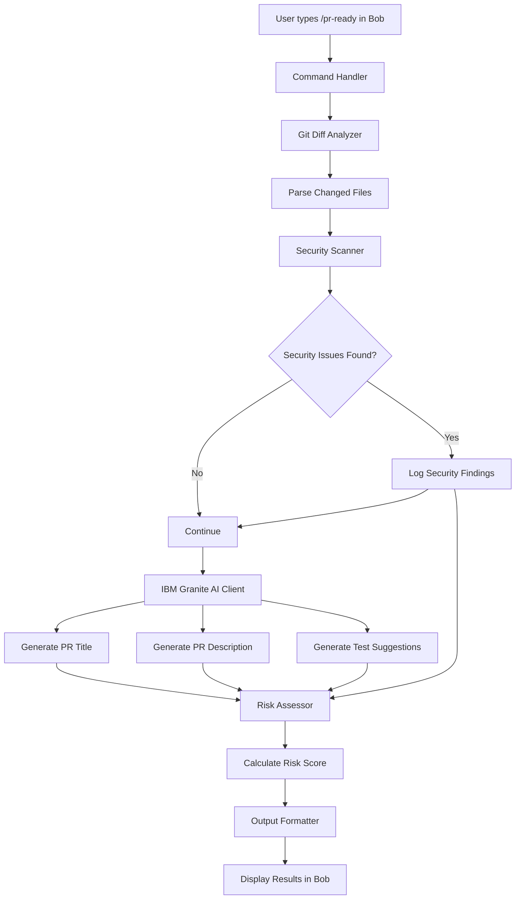
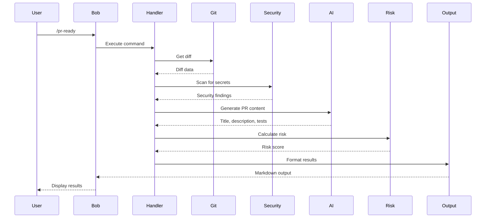
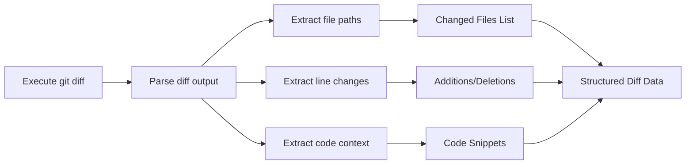
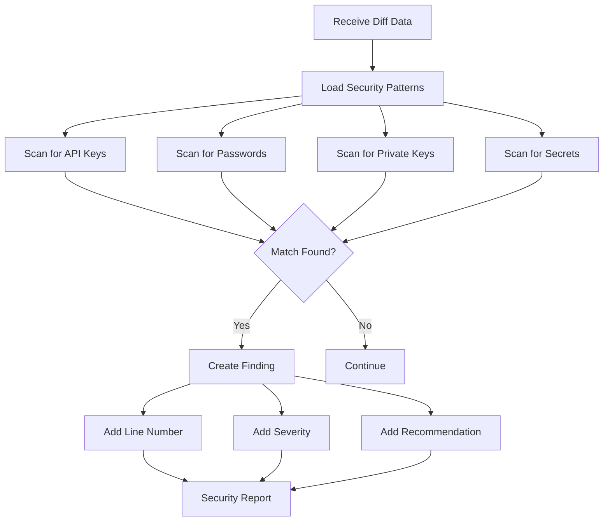
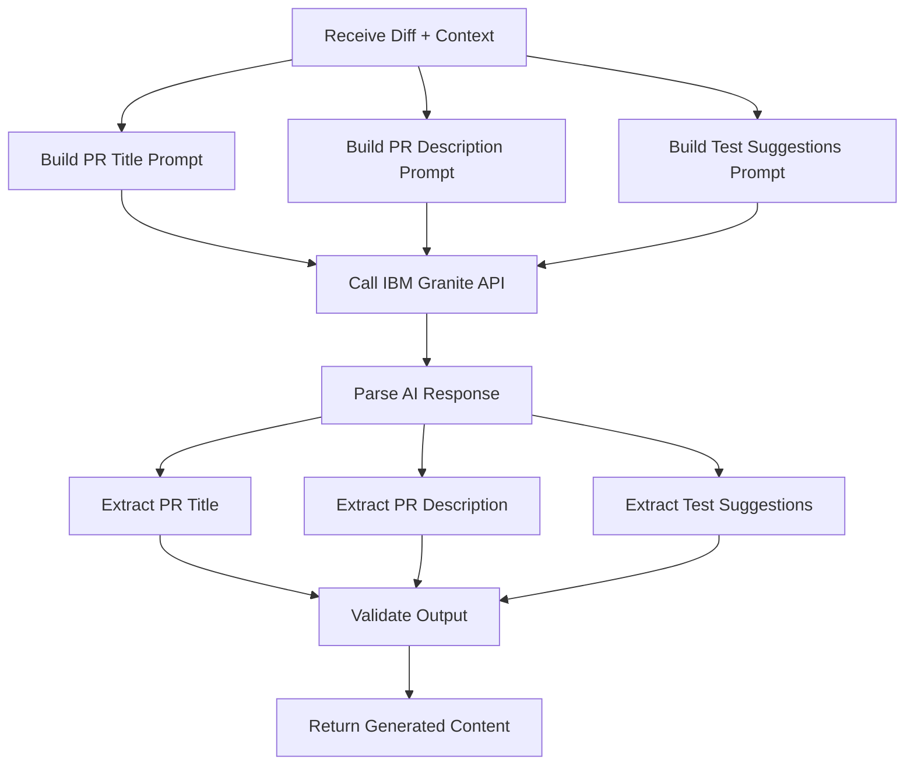
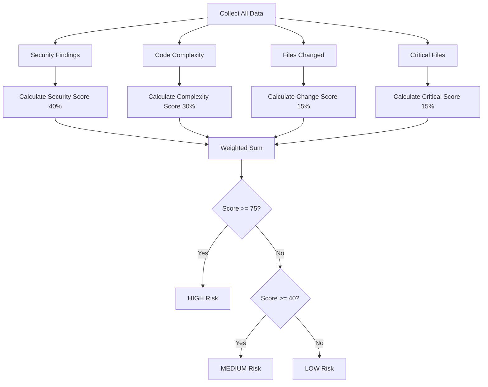
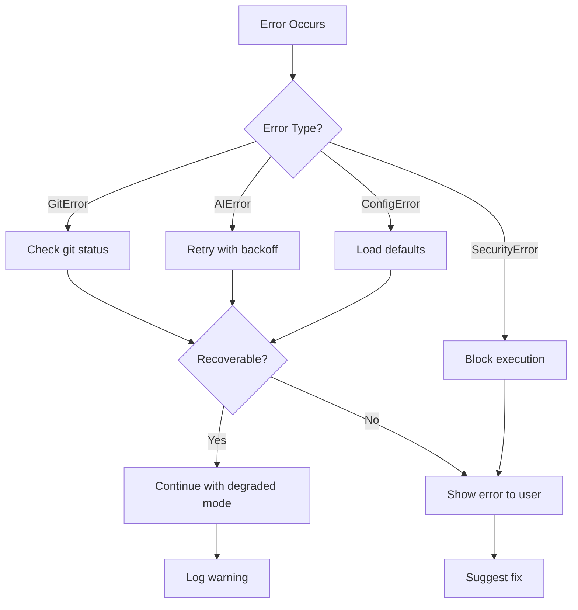
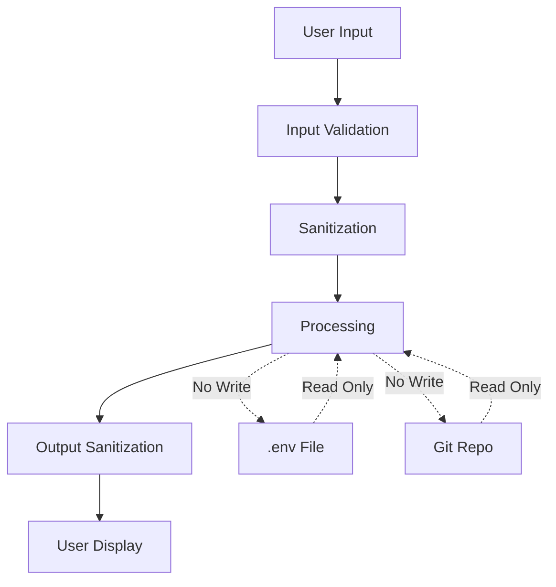

# PR Copilot - Architecture Documentation

## System Architecture Diagram



## Component Interaction Flow

### 1. Command Execution Flow



### 2. Git Diff Analysis Flow



### 3. Security Scanning Flow



### 4. AI Content Generation Flow



### 5. Risk Assessment Flow



## Data Flow

### Input Data
```typescript
// User Command
{
  command: "/pr-ready",
  options: {
    branch?: string,  // Optional: compare against specific branch
    verbose?: boolean // Optional: detailed output
  }
}
```

### Git Diff Data
```typescript
{
  files: [
    {
      path: "src/auth/login.ts",
      status: "modified",
      additions: 45,
      deletions: 12,
      changes: [
        {
          lineNumber: 23,
          type: "addition",
          content: "const token = jwt.sign(payload, SECRET);"
        }
      ]
    }
  ],
  totalAdditions: 45,
  totalDeletions: 12,
  totalFiles: 1
}
```

### Security Findings
```typescript
{
  findings: [
    {
      type: "API_KEY",
      severity: "HIGH",
      file: "src/config/api.ts",
      line: 15,
      content: "const API_KEY = 'sk-1234567890'",
      recommendation: "Move to environment variables"
    }
  ],
  totalFindings: 1,
  highSeverity: 1,
  mediumSeverity: 0,
  lowSeverity: 0
}
```

### AI Generated Content
```typescript
{
  title: "feat: Add JWT authentication system",
  description: {
    whatChanged: "Implemented JWT-based authentication...",
    whyChanged: "Addresses security requirements...",
    impact: "All API endpoints now require authentication..."
  },
  testSuggestions: [
    {
      type: "unit",
      description: "Test JWT token generation",
      codeSnippet: "describe('AuthService', () => { ... })"
    }
  ]
}
```

### Risk Assessment
```typescript
{
  overallRisk: "MEDIUM",
  score: 65,
  breakdown: {
    security: { score: 70, weight: 0.4, weighted: 28 },
    complexity: { score: 60, weight: 0.3, weighted: 18 },
    changeSize: { score: 50, weight: 0.15, weighted: 7.5 },
    criticalFiles: { score: 80, weight: 0.15, weighted: 12 }
  },
  recommendations: [
    "Fix security issues before merging",
    "Add comprehensive tests"
  ]
}
```

### Final Output
```typescript
{
  success: true,
  data: {
    prContent: { title, description },
    security: { findings },
    tests: { suggestions },
    risk: { assessment }
  },
  metadata: {
    executionTime: 3456,
    aiTokensUsed: 1234,
    timestamp: "2026-05-16T06:21:00.000Z"
  }
}
```

## Error Handling Architecture

### Error Hierarchy
```
Error
├── GitError
│   ├── NotAGitRepoError
│   ├── NoChangesError
│   └── GitCommandError
├── SecurityError
│   └── CriticalSecurityError
├── AIError
│   ├── AuthenticationError
│   ├── RateLimitError
│   └── TimeoutError
├── ConfigError
│   ├── MissingEnvVarError
│   └── InvalidConfigError
└── ValidationError
    ├── InvalidInputError
    └── InvalidStateError
```

### Error Recovery Strategy


## Performance Considerations

### Optimization Strategies

1. **Git Diff Parsing**
   - Stream large diffs instead of loading into memory
   - Parse incrementally for files > 1000 lines
   - Cache parsed results for repeated analysis

2. **Security Scanning**
   - Compile regex patterns once at startup
   - Scan only changed lines, not entire files
   - Parallel scanning for multiple files

3. **AI API Calls**
   - Batch multiple prompts when possible
   - Implement request caching for similar diffs
   - Use streaming responses for large outputs

4. **Risk Calculation**
   - Pre-calculate weights and thresholds
   - Use lookup tables for common patterns
   - Avoid redundant calculations

### Expected Performance Metrics

| Operation | Target Time | Max Time |
|-----------|-------------|----------|
| Git diff parsing | < 500ms | 2s |
| Security scan | < 1s | 3s |
| AI generation | < 5s | 15s |
| Risk calculation | < 100ms | 500ms |
| Output formatting | < 200ms | 1s |
| **Total** | **< 7s** | **< 22s** |

## Scalability Considerations

### Current Limitations
- Single repository analysis at a time
- Synchronous processing pipeline
- In-memory diff storage

### Future Enhancements
- Multi-repository batch analysis
- Async/parallel processing
- Persistent caching layer
- Webhook integration for auto-analysis

## Security Architecture

### Sensitive Data Handling
1. **API Keys**: Stored in `.env`, never logged
2. **Git Content**: Processed in memory, not persisted
3. **AI Responses**: Cached temporarily, cleared after use
4. **Logs**: Sanitized to remove sensitive patterns

### Security Boundaries


## Integration Points

### Bob Integration
- **Entry Point**: `.bob/modes/pr-copilot.json`
- **Command**: `/pr-ready`
- **Output**: Markdown formatted text
- **Error Display**: Formatted error messages

### IBM watsonx.ai Integration
- **Endpoint**: `https://us-south.ml.cloud.ibm.com`
- **Authentication**: IBM Cloud API Key
- **Model**: `ibm/granite-13b-chat-v2`
- **Rate Limits**: Respect IBM Cloud free tier limits

### Git Integration
- **Commands Used**: `git diff`, `git status`, `git branch`
- **Working Directory**: Current repository
- **Branch Comparison**: HEAD vs specified branch

## Configuration Management

### Configuration Layers
1. **Default Config**: Hardcoded defaults in code
2. **Environment Variables**: `.env` file overrides
3. **Runtime Config**: Command-line arguments
4. **User Preferences**: Future: `.pr-copilot.config.json`

### Configuration Priority
```
Runtime Args > .env > Default Config
```

## Logging Strategy

### Log Destinations
- **Console**: INFO and above (for Bob display)
- **File**: DEBUG and above (for troubleshooting)
- **Error File**: ERROR only (for critical issues)

### Log Rotation
- Max file size: 10MB
- Keep last 5 files
- Compress old logs

## Testing Strategy

### Unit Tests
- Each module tested independently
- Mock external dependencies (git, AI API)
- Target: 80% code coverage

### Integration Tests
- Test component interactions
- Use real git repositories (test fixtures)
- Mock only AI API calls

### End-to-End Tests
- Test full `/pr-ready` command flow
- Use sample repositories with known changes
- Verify output format and content

## Deployment Considerations

### Prerequisites
- Node.js 18+ installed
- Git installed and configured
- IBM Cloud account with watsonx.ai access
- Bob installed and configured

### Installation Steps
1. Clone repository
2. Run `npm install`
3. Copy `.env.example` to `.env`
4. Configure IBM Cloud credentials
5. Run `npm run build`
6. Test with `npm test`
7. Bob will auto-detect the mode

### Monitoring
- Log file analysis for errors
- AI API usage tracking
- Performance metrics collection
- User feedback collection